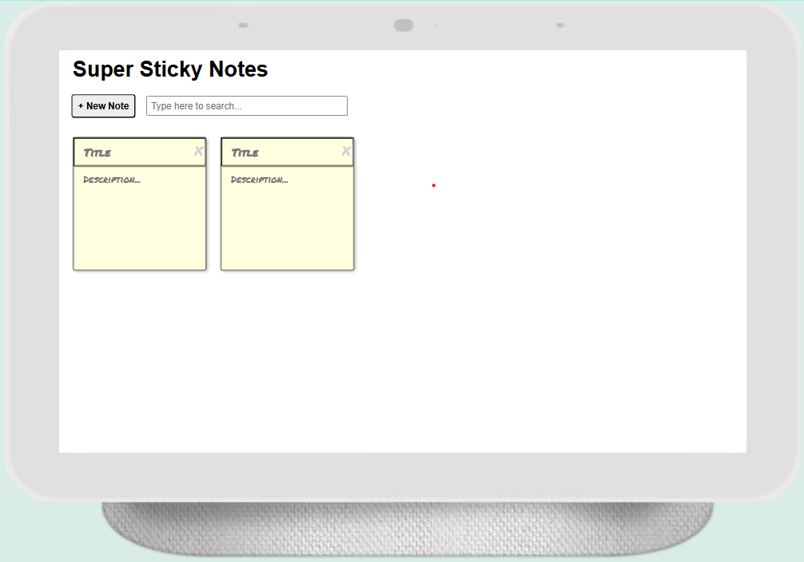

# 🗒️ Sticky Note App (React)

A minimalist sticky note app built with React. Users can create, edit, and delete notes that persist across sessions using local storage.

## ✨ Features
- **Add, edit, and delete notes** with a single click
- **Persistent storage** using the browser’s local storage
- **Responsive layout** with clean, intuitive design
- **Built with React functional components and hooks**

## 🧰 Technologies
- React (Hooks)
- JavaScript (ES6)
- HTML5 & CSS3
- Local Storage API

## 📸 Demo


## 🚀 Getting Started

To run the app locally:

```bash
git clone https://github.com/CreatedByCC/sticky-note-app.git
cd sticky-note-app
npm install
npm start
